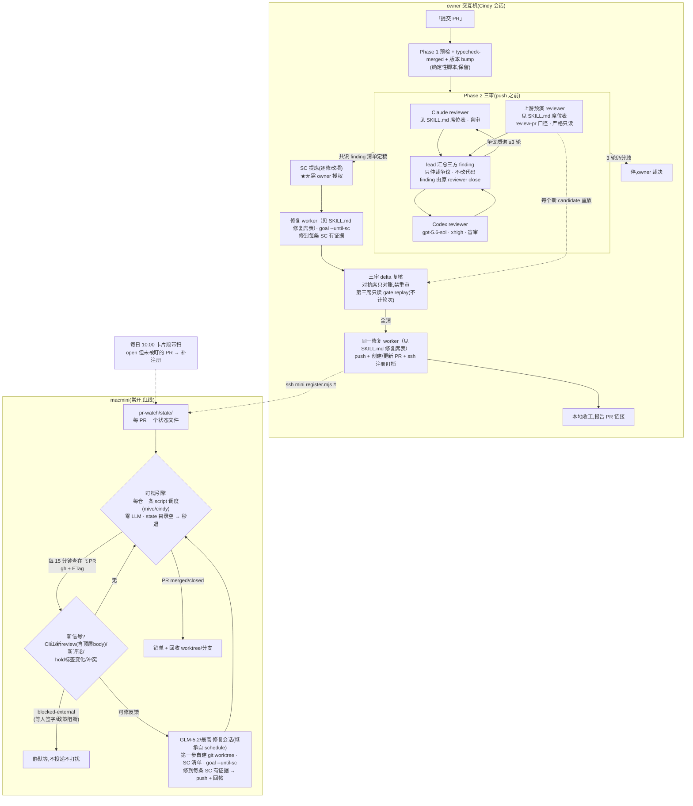

# 提交 PR 三审收口 + PR 定点盯梢自动修复 + 每日待办卡片 — 实施计划（定稿 · 终审 APPROVED）

> v1 → 审①(RC) → v2 → owner 定案 → v3 → 审②(RC) → v4 → owner 架构改向 → v5 → 审③(RC) → v6 → 审④⑤⑥⑦⑧⑨ 增量收敛 + owner 六次修订（SC 后置/glm-max/15min/通知分层/三审/六项自进化）→ **审⑨ 最终 APPROVED（2026-07-31）**
> 部署红线：**盯梢器与修复会话必须在 macmini（Praise-Mini）**；submit-pr 在 owner 交互机执行
> 多实例部署注意事项（双机抢单现状 + engine-mivo.json 通知目标不可直拷）见 `deploy/README.md` §2.1 ④。
> 状态：**定稿，实施基线。** 九轮对抗审查（gpt-5.6-sol/xhigh）全部意见采纳并逐条闭环核对；下一步 = §5 P0（首件事：修 mini gh token）。
>
> ⚠️ **模型配置已过时（2026-08-05）**：本文件是历史定稿存档，其中所有三审/仲裁的模型与档位（opus-5、gpt-5.6-sol 等）
> **一律不再作为派工依据**。当前唯一权威 = `skills/submit-pr/SKILL.md` 的 Phase 2 席位表（现为 sonnet-5/xhigh
> + 骨折 `codex/gpt-5.6-terra`/xhigh + sonnet-5/xhigh，仲裁席骨折 `codex/gpt-5.6-sol`/max）。流程、SC、机器门等
> 非模型内容仍以本文件为基线。

---

## 0.3 v6 修正清单（审查③后；F1/F2 经我读源码独立实锤）

| # | 发现 | 核实 | v6 处理 |
|---|---|---|---|
| **F1** | **script 调度的 `sessions.dispatch` 拿不到独立 worktree**：broker 明确拒绝 `use_worktree`/`working_dir`/`model`/`effort` 等参数（`rejectHostOwnedParams`），并硬编码 `useWorktree:false`，一切继承 schedule | **实锤**（`script-capability-broker.ts:200-230` 原文） | ① **每仓一条引擎 schedule**（mivo 一条、cindy 一条），`workingDir` 各指各的 checkout，schedule 自身设 `glm-5.2/最高` → 修复会话经继承拿到正确模型（继承机制同文件实证成立）；② 修复会话隔离改为**会话内自建 worktree 协议**：投递指令第一步强制 `git worktree add ../fix-<pr> && cd`，共享 checkout 上只允许 worktree add/remove（短临界区）；这是 S2 级弱保证（与 owner 已接受的安全档位一致），Cindy 宿主级 per-dispatch worktree 列 P3 上游 feature；③ P2 fixture 补"双 PR 并发不互踩" |
| **F2** | **goal skill 与本场景硬冲突**：场景 B 轮次=SC×3 上限 30 "到顶即停"；且全程遵守 autonomous-execution 硬停清单，**"对外发消息"硬停会挡 PR 回帖** | **实锤**（goal/SKILL.md Step 4 原文） | 改 goal skill（owner 自有）：新增 `--until-sc` 模式（无轮次/时长上限，仅 hard_stop 与预算告警可停）+ 本场景投递指令携带 owner 常设授权声明（PR 分支 push 与 PR 内回帖为已授权动作，不触发外发硬停）；$30/天语义维持 owner 原话"暂停等确认后继续"，与"修到 SC"不矛盾——是暂停不是放弃，文档加显式优先级说明 |
| **F3** | 原生 notifier 无条件追加 `agentKind · 模型名 · cwd` 元信息行，"零代码标识符"每张卡必失败 | 成立（我早前读 `notifier.ts:138-147` 时已见该段） | 发送通道改层级：**首选**卡片 agent 会话直接调 `cindy_feishu_bot` MCP 自发（P0 验证调度会话是否报 NO_CHAT_CONTEXT）→ 不通则向 Cindy 上游提 PR 加 `contentOnly` 通知模式 → 都不通才回退原生 notifier 并**如实告知 owner 卡尾会有一行技术元信息**（不静默违约） |
| **F4** | v5 写"保留合并后清理逻辑"，未显式删除 submit-pr 的 `--merge`/Phase 4a 合并确认/Phase 4c `gh pr merge` | 成立（我早前读 SKILL.md 结构时确认 Phase 4c 存在） | SP-1 改为**逐项枚举删除**：`--merge` 参数、Phase 4a 合并状态机、Phase 4c 全部 merge/ready 路径；只保留"观察到远端已 merged 后"的只读判定 + 本地清理，清理函数自身无 merge 能力 |
| **F5** | 双审共识未绑定到最终 push 的不可变工件（审的是 `main..HEAD`，lead 未 commit 的工作区改动逃逸复审；批准的 A 与 push 的 B 可能不同） | 成立（机制推理无可辩驳） | **SHA 绑定协议**：每轮=修改→验证→本地 commit→工作区 clean→记 candidate SHA→两 reviewer 独立审同一 `merge-base...SHA`；两份 APPROVED 必须携带同一 SHA；共识判定=**确定性脚本比对两份 verdict+SHA**（不由 lead 宣布）；修复 worker 收自包含 manifest（repo/remote/base/branch/**expected SHA**/标题正文/PR 号/注册 key），仅 `HEAD==expectedSHA && clean` 时普通 push，漂移即停 |
| **F6** | 注册成功 ≠ 引擎活着：写入 watchlist 但 schedule 不存在/paused/Cindy 没起，PR 永远无人盯，且是**假成功** | 成立 | 注册回执四要素：持久化成功 + 引擎 schedule active + 引擎 last-success lease 未过期 + 本 PR 首扫 ack；任一缺失=注册失败显式报 owner。另加**独立于 Cindy 调度器**的健康告警：mini launchd 每日脚本查 lease，超时经 bug-doctor 现成 notify.mjs Slack 通道告警（复用既有基础设施，零新依赖） |
| **F7** | 飞书回复不会天然路由回卡片会话（notifier 只发文本不带 session 绑定；入站走显式 binding 否则进默认 IM 会话），而"退直链"违反 owner 硬需求 | 成立（reviewer 引 `turnRunner.ts:452-502`，与 F3 通道改造联动） | **续聊分拣升为 P1 阻断出口**（不可降级上线）：验证"卡片会话 = owner 飞书默认会话绑定"或发卡时原子建立 binding，真实回复实测 sessionId/上下文/条目映射一致；不通过则 P1 不通过 |
| I1 | watchlist 单 JSON 的 flock 协议在 mini 上不成立（**mini 无 flock 命令**，且锁跟 inode 走、rename 后失效） | 成立（reviewer 实测 command -v flock 为空） | 改**每 PR 一个状态文件**（`pr-watch/state/<owner>__<repo>__<N>.json`），key 天然隔离，无共享锁；P2 fixture：并发 100 次注册/销单不丢 key |
| I2 | DeepSeek 幻觉约束只有文案没有机器门 | 成立 | 排序也收回脚本做（确定性）；DeepSeek 只做**受 schema 约束的逐项改写**：输入输出均为 `[{source_id, sentence}]`，validator 强制 ID 集合完全相等、URL/状态/主体不变、过"零代码标识符" lint；失败重试一次后回退确定性模板，**绝不发送未过验的输出** |
| I3 | 手动开的 PR 补盯窗口最长 ~24h | 成立 | 如实写入验收：自动覆盖只保证 submit-pr 路径；旁路 PR 恢复 SLO=24h，owner 知情接受（不暗示近实时） |
| I4 | 双审"共识"过度依赖 lead 摘要，两 worker 同材料易同质化 | 成立 | 初轮**盲审**（互相不见对方 finding）；两 worker 给**不同 lens**（Claude=正确性/回归/影响面，Codex=安全/边界/规范）；每条 finding 由**原 reviewer** 明确 close/维持，lead 不得代关；verdict+SHA 原样入本地 ledger，AND 门由脚本判 |
| I5 | 模型路由要锁四元组（agentKind/provider/model/effort），且修复会话要用 goal skill → **agentKind 必须 claude-code**（goal 在 ~/.claude/skills） | 成立 | 引擎 schedule 定为 `agentKind=claude-code + z-ai/glm-5.2 + 最高`；P0 验证实际落盘的 session meta（不是只看 dispatch 成功）；卡片 schedule 同理锁 deepseek 四元组 |
| I6 | "零动作"措辞与 2-5 分钟常驻 cron 矛盾 | 成立 | 措辞修正为"**空清单时零 GitHub 请求、零 LLM、零 token**；引擎心跳（读一次本地目录）仍在"——owner 在意的是钱和打扰，不是进程存在性 |
| I7 | `--fast` 旁路无留痕 | 成立 | `--fast` 仅限交互输入（自动会话禁用）；走 ledger 留痕；SHA/clean/禁 merge/禁 CI/禁 force 守卫**不因 fast 跳过**（fast 只跳双审） |

---

## 0. v5 架构定案（owner 2026-07-31 拍板）

**放弃 30 分钟常开轮询。自动修复的触发跟着 `提交 PR` skill 走**：

| 项 | 定案 |
|---|---|
| **触发架构** | submit-pr 收尾时把 PR **注册**进 mini 的盯梢清单；盯梢生命周期 = PR 生命周期（合并/关闭即销单）；**没有在飞 PR 时零 GitHub 请求、零 LLM、零 token（本地目录心跳仍在，见 §0.3-I6）**。物理边界如实声明：GitHub 无法推送到内网 mini、cindy 上游无权配 webhook，"发现新反馈"仍需向 GitHub 提问——但从"常开全局轮询"变为"**仅对在飞 PR 的定点盯梢**"（**每 15 分钟一查，owner 定案**；gh + ETag 条件请求，零 token） |
| **submit-pr 重构** | ① **删除 10 维度自审**（被三层取代：对抗双审 / 云端 CI 审查 / 盯梢修复）；② push **之前**做 **Orca worker 三审**：Claude=`<见 SKILL.md 席位表>` + Codex=`gpt-5.6-sol/xhigh` 并行盲审，**外加 `<见 SKILL.md 席位表>` worker 对当前 PR 按 review-pr skill 口径预演上游审查（严格只读）**；lead 汇总三方 → **共识 = 脚本对三方 finding 做 canonical union（保留 origin），放行门 = 三 verdict 同 input hash ∧ union 每条已被 origin close ∧ 三 verdict 均 APPROVED ∧ 全部 gate_checks∈{pass,n_a}**（≤3 轮，分歧停 owner）；③ **共识后自动进入修复，无需 owner 授权**（owner 2026-07-31 定案）：对共识确认的**全部修改项逐项提炼 SC** → 派 **修复 worker**（模型 `<见 SKILL.md 修复席表>`）用 **goal skill** 修到每条 SC 有证据 → 新 SHA 由**三审** delta 复核（只对账，禁重审；第三席对每个新 candidate 做只读 gate replay 并出新 verdict，**不计对抗轮次**）→ 全清后同一 worker 执行 push + 创建/更新 PR + ssh 注册盯梢 |
| **修复会话** | GLM-5.2/**最高**（继承自引擎 schedule 配置——宿主 broker 禁止 per-dispatch 指定，F1 实锤）；隔离=**会话第一步自建 git worktree**（宿主级 worktree 不可用，见 §0.3-F1）；从反馈提炼 **SC 清单**，**goal skill `--until-sc` 模式**（需先改 goal，见 §0.3-F2）驱动修到每条 SC 有证据；不限轮次不限时长 |
| **每日待办卡片** | 保持每日 10:00 一次的 Cindy 调度，但从"纯脚本"升级为 **agent 模式：`deepseek/deepseek-v4-pro`，effort=max（待验证，不支持则降 xhigh 并告知 owner）**。职责：采集与**排序均由脚本确定性完成**，DeepSeek **仅做逐项人话改写**（source_id 守恒校验，见 §3.1；风格契约见 §3.3）。<br>**卡片 schedule 期望四元组（审④-I3，session meta 验收的 expected value）**：`agentKind=claude-code` + `provider=Cindy AI` + `model=deepseek/deepseek-v4-pro` + `effort=max`；**唯一允许降级** `max→xhigh`（须在 ledger 留审计记录并在首张卡片脚注告知 owner），其余任何字段漂移=验收失败。飞书已连 Cindy：owner 可直接**回复机器人继续分拣**（会话须可续聊，见 §3.4） |
| **模型点名（第 0 优先，压过 routing 表）** | 三审（owner 2026-07-31 增补第三席）：对抗双审 `<见 SKILL.md 席位表>`，**再加一个上游预演 worker 对当前 PR 执行 review-pr skill 口径的预演审查**；lead 汇总三方反馈出共识；**共识后修复+push：`<见 SKILL.md 修复席表>`（同一 worker，goal skill）**；mini 盯梢修复会话：glm-5.2/最高；卡片：deepseek-v4-pro/max(降级 xhigh) |

---

## 1. 链路 A：提交 PR → 双审 → push → 盯梢 → 自动修复



### 1.1 submit-pr 改造清单

| 项 | 内容 |
|---|---|
| SP-1 | **删除**（逐项枚举，§0.3-F4）：Phase 3 十维度审查全部内容、**`--merge` 参数、Phase 4a 合并确认状态机、Phase 4c 全部 `gh pr merge`/`ready` 路径**。**保留**：Phase 1/1.5/1.6（预检/typecheck-merged/版本 bump）、"观察到远端已 merged 后"的只读判定 + 本地清理（清理函数自身无 merge 能力）、评论"（自动生成）"标记约定给 provenance 复用 |
| SP-2 | 新 Phase 2 **三审**（**SHA 绑定 + 盲审**；owner 2026-07-31 两次修订后定案）：commit 定格 **candidate SHA**（工作区 clean）→ `create_workers` 一次开**三个 worker**：<br>① Claude reviewer `<见 SKILL.md 席位表>`——盲审，lens=正确性/回归/影响面；<br>② Codex reviewer `gpt-5.6-sol/xhigh`——盲审，lens=安全/边界/规范；<br>③ **上游预演 reviewer `<见 SKILL.md 席位表>`——对当前 PR 按 review-pr skill 口径执行审查**（规则文件遵从/安全隐私门/格式门/产品·架构门语义预判），**严格只读**：禁止发 GitHub review/评论/合并/标签等一切对外写动作，只产内部报告（提前消化 push 后才会吃的上游打回；有 draft PR 时可读其上下文，但审的对象是本地 candidate SHA）；<br>三方均输出机器 JSON（⑨，`reviewer` 字段区分三席）；lead 汇总三方、只做**争议仲裁**（finding 由原 reviewer close/维持，lead 不得代关、不改代码）。<br>**共识定义（审⑦修正：不要求三份原始清单相同——lens 不同清单本就不同）**：脚本对三方 finding 做 **canonical union + 去重，逐条保留 `origin_reviewer`**；**放行门 = 三份 verdict 携带同一 `review_input_hash` ∧ union 内每条 finding 已被其 origin reviewer close ∧ 三份 verdict 均 APPROVED ∧ 共识脚本直接断言全部 `gate_checks ∈ {pass, n_a}`（审⑨补齐，四个 conjunct 缺一不可）**。③ 的阻断 finding **同样受 ⑪ 唯一 `primary_face` 约束**（格式→F、规则遵从→F、证据→G、隐私→E、文档→D）；产品/架构**过程门**不属七面，走 schema 内独立 `gate_checks[]` 通道（⑨），不得用无类型 finding 绕过 ⑪；其确定性门类项直接进修改清单不占对抗轮次。**③ 读过的 draft PR 上下文必须先快照为 `pr_context_digest` 并纳入 `review_input_hash`**（否则同 hash ≠ 同完整输入）。≤3 轮未收敛停给 owner，全程入 ledger |
| SP-2b | **共识 → 修复自动衔接（owner 定案：不需要 owner 授权）**：lead 对共识确认的**每个修改项提炼一条可验证 SC**（改什么/什么该成立/怎么验证），连同 finding 清单 + bundle 打成**修复 manifest** |
| SP-2c | 派 **修复 worker**（模型 `<见 SKILL.md 修复席表>`）持 manifest 修复：**goal skill（--until-sc）** 驱动到每条 SC 有 PASS 证据 → 新 commit 新 SHA → **三审 delta 复核**（两对抗席只对账 findings 修没修 + delta 有无新问题，禁重审未改代码；**第三席对新 candidate 做只读 gate replay 出新 verdict，不计对抗轮次**；最终 hash 绑定**三份**当前 candidate 的 verdict；unresolved 连续 2 轮不减 → 停给 owner） |
| SP-3 | 新 Phase 3：delta 复核全清后，**同一修复 worker**（模型 `<见 SKILL.md 修复席表>`）收**自包含 push manifest**（repo/remote/base/branch/**expected SHA**/标题正文/已有 PR 号/注册 key）；仅 `HEAD==expectedSHA && clean` 时普通 refspec push（漂移即停）→ `gh pr create/edit` → ssh mini 注册；**注册回执四要素**（§0.3-F6）：状态文件落盘 + 引擎 schedule active + 心跳 lease 未过期 + 本 PR 首扫 ack，任一缺失=注册失败显式报 owner（兜底靠每日补扫，但不静默） |
| SP-4 | 新增 `--fast` 参数：**只跳双审**（SHA/clean/禁 merge/禁 CI/禁 force 守卫不跳）；仅限 owner 交互输入，自动会话禁用；走 ledger 留痕（§0.3-I7） |
| SP-5 | worker 台账：派发说明带 `(model/effort)` 标注（对齐 orca 派工规则；模型为 owner 点名，第 0 优先） |
| SP-6 | **双审自迭代机制（owner 2026-07-31 要求，参照 review-pr 的 EVOLUTION.md 与 idea-outline 口味台账设计）**：<br>**漏检台账（escape ledger）**：mini 盯梢引擎本来就在消费远端反馈——每当远端（云端 CI 审查/Copilot/Codex/Greptile/人类）对一个**通过了本地三审**的 PR 打出 finding，自动比对该 PR 的**完整三审 ledger（含 `origin_reviewer`，审⑦：第三席已捕获的上游门类项不算漏检）**，比不上的 = **漏检**，自动记账：`{PR、远端 finding、本应命中的检查面、why-class}`。why-class 四选一定迭代方向：`face-gap`(检查面缺口/归属表漏项) / `lens-blind`(某 reviewer 的 lens 盲区) / `evidence-skip`(有面但没查证据,如 UI registry 漏路径) / `judgment`(判了但判错)。<br>**升级规则（阈值制,抄 idea-outline）**：同 why-class + 同模式 **≥2 次** → 生成 skill 修改提案（改检查面定义/归属表/lens 分工/registry）。**收紧类**（加检查项、补路径、扩 E 面 checklist）可自动落地走 PR；**扩权类**（放宽守卫、降低门槛、跳过检查）**永不自动落地**（抄 review-pr 铁律），只能提案等 owner。<br>**防误报加固（审⑥）**：① 幂等键 = remote node id，跨 bot/顶层/thread 的同一问题按 `repo+PR+headSHA(commitOid)+规整路径/symbol+语义指纹` **聚类合并**（多 bot 回声算一条）；② **只计在同一 head 上被确认 actionable 的**（实际被修复、或被明确接受）——stale/outdated/dismissed/纯建议/错误 finding 不计；③ 行号随修复漂移 → 比对用规整路径+symbol 不用裸行号；④ **"≥2 次"必须来自不同 PR（或不同独立 head）**，单 PR 内重复回声不触发；⑤ why-class 先记 `pending`，经规则或人工确认后才转正。<br>**自动落地纪律**：收紧类提案只允许在**专用 worktree** 开分支提 PR（不碰共享 checkout，与 W-2 临界区规则一致），必须带误报回归 fixture + 正常过审过 CI，**禁止自动合并**。<br>**复盘节奏**：漏检发生即记账（不等收尾）；每 10 条或每周由每日卡片附一行"双审漏检 N 条待复盘"提醒 owner。台账入 mivo 仓 `agent-use/docs/dual-review-evolution.md`（团队可见） |

### 1.1b 对抗式双审基线 v1（owner 要求"有限基线,不无限猫捉老鼠";由三份实证研究合成:GD L3 机制层 + GD L3 实例层 + cindy 仓 86 项真实审查反馈归纳,2026-07-31）

**① 锚点先行（GD 最大教训："没有锚点就没有反发散"；SC 时机为 owner 2026-07-31 纠正后定案）**
**审查阶段的锚点 = 下方七个固定检查面**：每条 finding 必须锚到检查面（`primary_face`），无锚点的 finding 按 ⑪ 规则处理。
**SC 提炼发生在双审达成共识之后**：lead 对共识确认的**每一个具体修改项**提炼一条可验证 SC（改什么 → 什么该成立 → 怎么验证），SC 清单交给修复 worker（模型 `<见 SKILL.md 修复席表>` + goal skill）作为执行目标；**共识 → 修复自动衔接，不需要 owner 授权**。（v6 曾写"派审前提 SC 作审查锚点"，owner 纠正：SC 是修复的验收合约，不是审查的输入。）

**② 固定检查面（审⑧明确适用范围：**两对抗席**必须逐七面填 `pass/fail/n_a` + 证据，两份表的差异即仲裁点；**第三席**只填与其口径相关的 faces（F/G/E/D 为主）+ `gate_checks[]`，不强制七面全填）**
**gate_checks 确定性判定（审⑧）**：任何 `gate_checks.result=fail` → 第三席 verdict **必为 REQUIRES_CHANGES** 且该项直接进修改清单；修复后由第三席在 replay 中改判 pass；共识脚本**直接断言全部 gate_checks ∈ {pass, n_a}**，不以模型自报的总 verdict 为准。

| 面 | 内容 | 依据（cindy 实证频次/权重） | 备注 |
|---|---|---|---|
| A 正确性 | 状态机分支/竞态/交互阻断/unhandled promise | ~17 条,P1 密集,上游打点第一名 | 双 lens 主战场 |
| B UI 规范+无障碍 | 设计值 vs px、token、44pt 触达、读屏/焦点/lang | ~14 条,多 P1 | **diff 未命中 UI 路径则整面 n_a**,不许硬找 |
| C 测试 | 单测绿灯、断言鲁棒性、QA 工件同步 | ~12 条,含阻塞例 | 该仓把 demo 工件当代码审 |
| D 文档一致性 | 注释引用的章节/文件存在性、索引收录、描述与实现一致 | ~17 条但几乎全低权重 | **默认只产建议**,仅"索引缺失"可阻塞 |
| E 安全/凭证 | 授权链路是否被误删、隐私/统计开关、密钥 | 仅 4 条但全 P1、模式固定 | **always-on 窄门 checklist**,不占轮次 |
| F 范围合规 | owned_paths、禁碰 CI 路径、force refspec | 机械判定 | 脚本预检,reviewer 只复核 |
| G 声称核实 | PR 描述声称"已测试/已验证"的,证据是否真实存在 | GD 实证:双审独立命中 4/4 全是"执行结果撒谎" | **双审最高价值命中面** |

**明确不设的维度**（cindy 86 项实证零命中）：产品语义（人工审批事项,AI 猜方向只产噪声）、软件架构（0 条真实发现）、日志（仅 1 例,并入 A 面）。

**③ Blocker 白名单（照抄 GD §4,实践验证过）**
`REQUIRES_CHANGES` 仅限：active path 失败 / SC 未达成 / 状态污染 / 安全风险 / 核心验证缺失 / 范围违规。**不得阻塞**：风格偏好、架构洁癖、dormant code、无失败证据的优化、超出 diff 主题的重构建议。非阻塞意见只能进 Residual Risk 附录，**不计入共识判定**。

**④ 首轮穷举（GD §9,反挤牙膏核心）**
首轮必须一次列全所有可发现 finding。后续轮冒出"首轮就能看到但没报"的 → 该 reviewer 本轮记 `degraded`，不得 APPROVED。

**⑤ 轮次纪律（GD /review2 delta-scope 工程化落地）**
≤3 轮。**Round 2+ 只做两件事**：对账 baseline findings 是否修复 + 检查上轮 SHA→新 SHA 的 delta 是否引入新问题；**禁止重审未改动代码**。unresolved 连续 2 轮不减 → 停给 owner。

**⑥ 共识 = 脚本判（GD Merge Matrix；审⑧统一为唯一算法，以 SP-2/⑩ 为准）**
**三份** verdict 携带同一 `review_input_hash` ∧ canonical union 内每条 finding 已被其 `origin_reviewer` close ∧ 三 verdict 均 APPROVED ∧ **共识脚本直接断言全部 `gate_checks ∈ {pass, n_a}`（不信模型总 verdict）**；冲突取更严 verdict 并要求 `arbitration_reason`；lead 只仲裁争议，不代关、不宣布。

**⑦ fail-closed（GD 实例层最大失效模式:10/22 条是审查工具自己跑挂）**
reviewer 超时/跑挂/输出不合 schema → `degraded` ≠ APPROVED，绝不静默当过。检查面结果为空 ≠ pass。

**⑧ 与其他层的分工（防重复跑,cindy 报告关键提醒）**
证据完整性（截图/demo）与格式门 → submit-pr 确定性脚本预检（不占 reviewer 轮次）；过程门（产品/架构讨论路由）→ 上游 review-pr/云端审查；**双审专注 diff 内代码 + G 面声称核实**——即外部 bot（Copilot/Codex/Greptile）实际会打、而 MagicLizi 现有基线不覆盖的那些点。

**——以下 ⑨〜⑫ 为审查④后增补（v7）——**

**⑨ 机器契约（审④-F1）**：reviewer 输出分两份——人读 markdown + **机器 JSON**（共识脚本只读后者）。JSON schema 版本化落盘 `agent-use/docs/review-verdict.schema.json`（v1），必填：`schema_version / reviewer / run_status / round / base_sha / candidate_sha / review_input_hash（审⑥同步：verdict 携带的是派审前可算的 input hash，见 ⑩；consensus_artifact_hash 由共识脚本另行固化为独立 consensus artifact JSON，不在 reviewer 输出里）/ faces[]（face,result,evidence）/ findings[]（id,primary_face,related_faces,severity,anchor,evidence,status）/ **gate_checks[]（gate_id,result,evidence——第三席过程门（产品/架构）专用通道，审⑦：不属七面的门项走这里，不得用无类型 finding 绕过 ⑪）** / verdict / closed_finding_ids / arbitration_reason`。**任何 schema 校验失败一律 degraded，不设"轻微格式偏差"灰区**；实现须附 parser/merge fixtures。

**⑩ 两段式 hash 绑定（审④-F2 堵"批准 A 推送 B"；审⑤纠正因果环；审⑥清残句后定稿）**：<br>`review_input_hash = hash(base_sha + candidate_sha + PR 标题/正文 + touches_ui + matched_paths + ui_registry_config_hash + pr_context_digest)` —— 派审前可算，**三份** verdict 各自携带（UI 三字段在此入锅；`pr_context_digest` = 第三席读取的 draft PR 上下文快照，审⑦补——否则同 hash ≠ 同完整输入）；<br>`consensus_artifact_hash = hash(review_input_hash + canonical 共识 finding 清单 + 三份 verdict hash)` —— 共识定稿后由脚本生成；<br>**门禁链**：三份 verdict 携带同一 `review_input_hash` → 共识脚本据此生成 `consensus_artifact_hash` 并绑定三份 verdict → 修复 manifest 绑 `consensus_artifact_hash + SC 清单 hash` → push manifest 比对 delta 复核全清后的最终 `consensus_artifact_hash + SC hash`，一致才放行。<br>Round 2+ 的 delta 定义扩为：代码 diff **+ SC/标题/正文/验证声称的元数据 diff**——改 PR 正文或新增"已验证"声称同样触发回炉；**G 面不受"禁重审"豁免**。

**⑪ finding 归属规则（审④-F3，堵 fail-silent）**：每条 finding **恰好一个 `primary_face`** + 可选 `related_faces`（不重复计数）。交叉归属表：测试声称缺证据→G、授权路径运行失败→E、描述与实现不符→（实现错→A / 描述错→D / 声称假→G）。**A 面兜底一切 active-path 正确性**（兼容、迁移、构建集成、资源泄漏）。命中 ③ blocker 白名单但映射不进任何面 → 记 `taxonomy_gap` 并 **degraded 停轮，禁止丢弃**——"无锚点即无效"只适用于白名单外的意见，绝不静默删真 P1。

**⑫ UI 判定唯一源（审④-F4，已实锤：现 `UI_PATHS_RE` 只含 cindy 仓路径 `apps/desktop/src/renderer|apps/mobile|DESIGN.md|packages/*login`，mivo 的 `src/app`/`src/canvas` 完全不在内 → mivo UI PR 会被判非 UI，demo 门不触发，push 后必被上游证据门打回）**：每仓一份**版本化 ui-paths registry**（mivo 的入 `agent-use/docs/`）；确定性脚本产出 `touches_ui + matched_paths + config_hash` 写入 review bundle；**B 面仅当脚本判 false 才允许 n_a，reviewer 无自判权**；demo 证据预检复用同一判定结果；`--skip-demo-gate` 改为需 owner 显式理由 + ledger 留痕，且用后**不得声称"证据完整"**。

### 1.2 mini 盯梢器（新建 `pr-watch/`，入 mivo 仓）

| 项 | 内容 |
|---|---|
| W-1 | `register.mjs` / `unregister.mjs`：**每 PR 一个状态文件** `pr-watch/state/<owner>__<repo>__<N>.json`（§0.3-I1：mini 无 flock 命令，单 JSON 共享锁方案废弃；每 PR 一文件 key 天然隔离，tmp+rename 只防半文件即可）；引擎心跳写独立 lease 文件 |
| W-2 | 引擎 = **每仓一条 script 模式 Cindy 调度**（§0.3-F1：broker 禁止 per-dispatch 指定 working_dir/model/effort/worktree，一切继承 schedule → mivo 与 cindy 必须各一条，`workingDir` 各指各的 checkout，schedule 自身设 `agentKind=claude-code + z-ai/glm-5.2 + 最高`，修复会话经继承获得该配置）：**cron 每 15 分钟（owner 定案）**，`execution_mode=script` 零 LLM；首步扫 state 目录，**空 → 立即退出（零 GitHub 请求、零 token；进程心跳仍在，§0.3-I6 措辞）**；起修复会话走 `sessions.dispatch`；**修复会话隔离 = 投递指令第一步强制 `git worktree add ../fix-<pr>` 并切入**（宿主 `useWorktree:false` 硬编码，会话自建是 S2 级弱保证；共享 checkout 上只允许 worktree add/remove 短临界区）。B 案（纯进程 + claude CLI 无头）仅当 A 案 P0 验证失败时启用 |
| W-3 | 信号判定继承 v4 全部定案：按类型分判（CI 看状态跃迁 / review 按 thread + **顶层 review body**（PullRequestReview id/state/commitOid）/ 评论按 node id 游标 / hold 标签 → `blocked-external` 静默等）；`ciReadiness(headSha)` 契约判绿（只看 required contexts，缺席/pending/读不到=非绿，不用 mergeStateStatus）；指纹=`headSHA+blocker digest`；**at-least-once** 语义 + 副作用幂等（固定 worktree 名、回帖先查重、恢复先探测）；provenance=HMAC 签名标记 + node-id ledger 仅加速 |
| W-4 | 修复会话投递：SC 清单 + **goal skill `--until-sc` 模式**（§0.3-F2：需先改 goal——现有场景 B 有 SC×3/上限 30 硬顶，且"对外发消息"硬停会挡 PR 回帖；新模式无轮次/时长顶，投递指令携带 owner 常设授权声明覆盖回帖硬停；goal 不可用则退普通模板带 SC）；push 前守卫（`originalHead..candidate` 不碰 CI 路径 / 拒 force refspec / CAS 复查 head 未变且 PR 仍 open）——S2 弱保证 + 服务端 ruleset 禁 force-push（v4 §安全定案不变） |
| W-5 | 终态：PR merged/closed → 销单 + 清理 worktree/本地分支；**绝不合并**（代码里无合并路径） |
| W-6 | 预算：轮次/时长不设限（owner 定案）；cindy PR 卡死不打扰只记台账；mivo PR 卡死飞书点名；全局 $30/天兜底闸=暂停等确认 |
| W-7 | **独立健康告警（审④-F5 落正文；通知通道按 owner 2026-07-31 分层定案改走飞书）**：mini launchd 每日脚本查两条引擎的 lease 文件（TTL 超时=引擎死）。**告警走飞书个人通知**（"我的机器人出问题"属个人级），实现为**独立脚本直连飞书 bot API**（不经 Cindy notifier，保住"Cindy 整体死掉也能叫人"的独立性）；飞书 bot 凭证在 launchd 环境不可得时降级 Slack `notify.mjs` 并在消息里注明是降级通道。交付含 plist 安装/回滚步骤；P2 fixture：暂停引擎 schedule / 伪造过期 lease，必须收到告警 |
| W-8 | **通知分层总则（owner 2026-07-31 定案）**：**Slack = 项目级广播**（合并致谢、面向全体贡献者的播报——现有 review-pr 行为不变，本计划不动）；**飞书 = owner 个人通知**（我的 PR 卡死点名、$30 预算闸、引擎健康告警、每日待办卡片、双审分歧裁决请求）。本计划新增的一切"叫 owner"场景一律飞书，不进 Slack |

### 1.3 自进化环节（owner 2026-07-31 定案六项）

**统一纪律（六项通用，抄自 review-pr EVOLUTION.md + idea-outline 口味台账 + SP-6 审⑥加固）**：
台账先行、发生即记账不等收尾；根因分类先记 `pending` 经确认转正；聚类幂等（防回声刷账）；**升级阈值 ≥2 次且必须来自不同实例**（不同 PR/不同天/不同会话）；**收紧类提案可自动提 PR**（专用 worktree、带误报回归 fixture、过审过 CI、禁自动合并），**扩权类永不自动落地**；台账入 git 团队可见；每日卡片附一行未复盘计数提醒 owner。

| # | 环节 | 信号源（全部现成，零新增采集） | 台账记什么 | 升级动作 |
|---|---|---|---|---|
| E1 | **双审漏检** | 盯梢引擎消费的远端反馈 vs 本地三审 ledger | 见 SP-6（含审⑥防误报加固） | 改检查面/归属表/lens/registry |
| E2 | **UI 路径 registry** | push 后被上游证据门打回 = registry 漏路径实锤 | `{PR、漏判路径、上游打回原文}` | **自动提案补路径**（纯收紧，全自动提 PR） |
| E3 | **SC 提炼质量** | 修复 worker goal 跑偏 / SC 全 PASS 但 CI 仍红 / 修完被 delta 复核打回 | `{SC 原文、失败模式、回溯根因：不可验证/歧义/漏项}` | 迭代 SC 提炼模板（好/坏例句库进 skill） |
| E4 | **盯梢信号判定** | 漏唤醒（PR 有新反馈但引擎未派活，事后从时间线可查）/ 空唤醒（派活但修复会话判定无实质新反馈） | `{PR、信号类型、指纹前后值}` | 迭代指纹字段/信号规则（漏唤醒=收紧类可自动；放宽判定=扩权类只提案） |
| E5 | **修复模型档位** | 同类卡点 GLM 连续修不动、最终靠 owner 人工收尾 | `{卡点语义指纹、尝试轮数、最终解法}` | **只产升档提案**（如"CI 类型错误建议升 opus"），改 routing 是花钱决定，永不自动 |
| E6 | **安全守卫命中** | A-7/W 系守卫的事后检测命中记录（含未遂：force refspec 被拒、CI 路径 diff 被拦、push 时 head 漂移） | `{会话、guard id、内容 hash、**已脱敏摘要**}`。**入账前确定性脱敏（审⑧：安全台账自己不能变成泄密源）**：token/secret/header/env 值**绝不落盘**，命令与 diff 只存 guard id + hash + 脱敏截断摘要；台账文件过 secret-lint 才许提交（P2 加 secret-lint fixture） | 守卫规则收紧提案；**同类命中 ≥2 立即飞书点名 owner**（安全类不等复盘周期） |

**实施排期**：六项的**台账采集全部随 P2 上线即开始**（信号都在既有链路里，记账成本≈0）；**升级提案机制**本期只实装 E1+E2（信号最密、纯收紧），E3〜E6 台账攒到有真实数据后在 P3 逐个开启提案循环——自进化自己也得吃数据，先记账后进化。

### 1.3a 自进化周会（owner 2026-07-31 定案：独立自动化进程）

- **载体**：mini 上一条**独立 agent 调度**「自进化周会」，cron `0 0 * * 1`（周日晚 24:00），四元组 `agentKind=claude-code + z-ai/glm-5.2 + max`
- **流程**：读**过去 7 天**六项台账 → 聚类出达阈条目（≥2 跨实例，规则见 §1.3）→ 对每个达阈根因**提炼 SC**（改哪个文件 / 改后什么该成立 / 用哪个回归 fixture 验证）→ **goal skill `--until-sc` 执行** → 产出 = **提案 PR**（专用 worktree）
- **红线全程生效（§1.3b R1–R10 对周会同样约束）**：白名单外 diff 被门禁拦、永不自动合并、扩权/花钱类只产提案文本、每周 ≤3 个提案 PR、被拒根因不重提
- 无达阈条目 → 写一行日志退出（零成本常态）；周会结果（提了哪些 PR / 哪些只提案）进周一早 10:00 卡片
- **容器定案**：**owner 个人仓（默认名 `PraiseZhu/pr-autopilot`，可改）= 整个自动化链路的功能容器 + 自进化台本容器**——skill 源 / 全部脚本 / schema / fixtures / 部署文档入此仓，mivo/cindy 侧按 Review-PR 既有模式（clone + 软链 + 各仓配置）接入；**运行时台账数据不入此仓**（E 台账留在各业务仓与 mini 本地，台本与数据分离）

### 1.3b 自进化红线（宪法层，owner 2026-07-31 定案："允许自进化，但严格设红线"）

**执行原则：红线全部机器可查（路径黑白名单 + 确定性检查），不依赖提案会话的自觉。**

| # | 红线 | 执行机制 |
|---|---|---|
| R1 | **永不自动合并**。一切自进化 PR 与人写 PR 同权：过三审、过上游审查、由云端流程或 owner 合并 | `securityReviewPaths` 已覆盖自动化自身路径→强制转人工；提案会话无合并动作 |
| R2 | **扩权类永不自动**。放宽守卫/降低门槛/跳过检查/扩大写权限/新增对外动作——只能生成提案文本进飞书卡片等 owner | 提案分类器 + diff 方向检查（删除检查项/放宽正则/扩 allowlist = 扩权特征，命中即降级为纯提案） |
| R3 | **宪法层文件禁触**。自进化 PR 的 diff 不得落在：A-7/W 系守卫脚本、S2 检查、secret-lint、gate_checks 判定、四 conjunct 共识脚本、`ciReadiness` 契约、**本红线清单自身** | **路径黑名单**由 push 守卫硬拦（复用 A-7 的 CI 路径拦截机制）；改宪法层只能 owner 亲自动手 |
| R4 | **不得改自进化机制自己**。台账 schema、聚类规则、≥2 阈值、why-class 定义——防"自己放宽自己"的自指漏洞 | 同 R3 路径黑名单 |
| R5 | **不得碰钱和打扰参数**。模型档位、$30 预算、15 分钟频率、通知路由（W-8）——E5 类只提案 | 同 R3；这些参数文件列入黑名单 |
| R6 | **不得动 CI 配置 / 分支保护 / ruleset**（owner 既有硬停线，对自进化同样生效） | A-7 守卫已拦 CI 路径；分支保护/ruleset 在服务端，token 侧不给提案会话 admin 操作指令 |
| R7 | **diff 只许落在进化白名单**：检查面定义文案、归属表、lens 分工文案、ui-paths registry 数据、SC 提炼模板例句库、pr-rules 中的纯收紧字段 | **路径白名单**：提案 PR 的 changed files ∉ 白名单 → 门禁 fail，不进审查直接打回 |
| R8 | **提案限流**：每周自动提案 PR ≤ 3；被拒过的同根因提案**不得重提**（除非台账出现新证据实例） | 提案生成前查 ledger 的 proposal 历史（含被拒记录），机械判 |
| R9 | **台账 append-only**。自进化不得删改历史台账条目——防"洗数据凑阈值/消灭失败记录" | 台账文件走 append 模式 + git 历史即审计线；提案 PR 若含台账删改 → R7 白名单拦下 |
| R10 | **每次自动落地必须附带**：误报回归 fixture + 专用 worktree + 提案理由引用具体台账条目 id（可追溯到原始事件） | PR 模板机械校验三要素，缺一即格式门 fail |

**自指保护的闭环**：R3 把"红线清单自身 + 守卫脚本 + 共识脚本"划为宪法层，R4 把自进化机制自身也划进去——进化系统**改得了业务规则，改不了改规则的规则**。要动宪法层只有一条路：owner 亲自改。

## 2. 已废弃项（防止实现者从旧版恢复）

- ~~30 分钟常开 Cindy 轮询 + preRunHook 全局 gate~~（v3/v4 方案，v5 起废弃）
- ~~submit-pr 十维度审查~~
- ~~review-pr §5.4 `selfFixAuthors` 启用路径~~（保持留空；与盯梢器互斥，见 v4 P3 定案）
- ~~自建飞书发送器~~（v4 已废弃，走 scheduler 原生 notify_feishu；**例外：W-7 独立健康告警的直连 bot API 脚本不在废弃之列**——它的存在意义正是"不依赖 Cindy"）
- ~~review skill（自研 Claude+Codex 双审 skill）~~（owner 2026-07-31 已删；其双审思想由 SP-2 的 worker 通道实现取代）

## 3. 链路 B：每日待办卡片（v5 升级为 DeepSeek 渲染）

### 3.1 两段式结构

```
每日 10:00 Cindy 调度(agent 模式: deepseek/deepseek-v4-pro · max*)
   │
   ├─ 第一段(确定性脚本,agent 只负责调用):
   │    collect.mjs — 拉通知(all=true, since=24h, 全分页≤50/页)
   │    → 落桶 B(等拍板)/C(被@或被回)/E(PR被他人关/issue not_planned)
   │    → 真实性预检(API 矩阵逐线程核对,fail-closed 记"预检异常")
   │    → D 桶后台标已读(先消费 thread 事实;只写 marked-read.jsonl,卡片零出现)
   │    → 顺带扫 open 但未注册盯梢的自有 PR → 补注册(链路 A 兜底)
   │    → 输出结构化 JSON
   │
   ├─ 第二段(DeepSeek 渲染,带机器门 §0.3-I2):
   │    排序收回脚本做(确定性:阻塞别人的 > 等我拍板 > 被@ > 被关 > 其他)
   │    DeepSeek 只做逐项改写:输入输出均为 [{source_id, sentence}]
   │    validator 强制:ID 集合完全相等 / URL·状态·主体不变 / 过零代码标识符 lint
   │    失败重试 1 次 → 仍失败回退确定性模板,绝不发送未过验输出
   │
   └─ 发送通道(§0.3-F3,按优先级):
      ① 卡片会话自己调 cindy_feishu_bot MCP 发(P0 验证调度会话是否 NO_CHAT_CONTEXT)
      ② 不通 → 给 Cindy 上游提 PR 加 contentOnly 通知模式(原生 notifier 会无条件
         追加"agent·模型·路径"元信息行,违反零代码标识符契约)
      ③ 都不通 → 回退原生 notify_feishu,如实告知 owner 卡尾有一行技术元信息
      6000 字上限超则先摘要+overflow 游标;空结果也发"今天没活"心跳卡
```

*effort=max 待验证：codex 通道 max/ultra 仅部分模型支持；不支持则降 xhigh 并在首张卡片脚注告知。

### 3.2 与 v4 的差异

只有渲染层从"脚本拼模板"换成"**脚本排序 + DeepSeek 逐项人话改写**"；采集/分桶/排序/预检/标已读/幂等 journal/心跳卡/catch-up 全部继承 v4 定案不变。成本：每天一次 DeepSeek V4 Pro 会话，量级可忽略。

### 3.3 卡片风格契约（owner 2026-07-31 给定，逐字落实）

| 维度 | 要求 |
|---|---|
| 骨架 | 按优先级排序，最该先看的在最上面 |
| 语言 | **全是自然语言句子，零代码标识符**（不出现反引号/路径/函数名式写法；scheduler 通道本身也会剥反引号，双重约束一致） |
| 受众 | 写给"扫一眼想知道发生了什么"的人 |
| 完整性 | **每行一个完整意思**（不写半截话、不用需要上下文才懂的缩写） |

示例行（契约的具象化）：`【等你拍板】cindy 仓的登录页改版讨论,机器人已给出两个方案,等你选一个才能继续`

### 3.4 飞书续聊分拣（owner 需求：回复机器人做下一步分拣）

飞书已连 Cindy。要求：卡片发出后 owner 在飞书里回复，能落到**有上下文的会话**继续分拣（"第 2 条帮我回复同意"这类）。
**§0.3-F7 升级：这是 P1 的阻断出口，不可降级上线**——飞书入站默认走显式 binding，否则落到 owner 的默认 IM 会话（没有卡片上下文）。P1 必须验证：调度会话与 owner 飞书身份建立 binding（或调度绑定到 owner 默认会话），用**真实回复**实测 sessionId、上下文、"第 N 条"映射三者一致；验证不过 = P1 不通过，不允许以"卡片带直链"降级交付。

## 4. 继承自 v1–v4 的已核实事实与定案（不重复展开，实现前必读）

- **P0 阻塞不变**：① mini gh token 失效（第一件事）；② mini 无 cindy checkout，需 clone + fork remote 配置（push 目标=PraiseZhu/cindy-fork）；③ 飞书绑定：owner 先私聊一次 Mivo bot（`getOwnerOpenId()` 空则静默不发）；④ preRunHook 失败语义已确认（2026-08-08：宿主为 **fail-open**，部署必须接 `deploy/wrappers/probe.mjs` 的 exit 2 协议包装为 fail-closed——见 deploy/README.md §2.1 ③，不再列为实测项）；⑤ missed-fire 补跑语义实测。**新增**：⑥ deepseek effort 上限；⑦ `sessions.dispatch` 从 script 调度起 GLM 会话的端到端验证（model/effort 落盘核对）；⑧ goal skill 在 mini 可用性；⑨ 跨设备派工（closed issue #814 标 completed）是否提供比 ssh 更原生的注册通道——顺带验证，不阻塞；⑩ 调度产生的 agent 会话调 `cindy_feishu_bot` MCP 是否报 NO_CHAT_CONTEXT（决定卡片发送通道走 §3.1 的 ①还是②）；⑪ dispatch 出的会话 session meta 实测四元组（agentKind=claude-code / provider / z-ai/glm-5.2 / 最高）而非只看 dispatch 成功；⑫ **W-7 直连飞书告警的三前提实测**（审⑤新增）：launchd 同环境下凭证可读、bot API 可达、真实试发一条成功——且凭证不落库不打日志
- **安全定案（v4 §0.1）**：S2 弱保证 + GitHub 服务端护栏（mivo 分支保护"CI 必绿+管理员不豁免"挡合并；ruleset 禁 force-push——mivo 上是否启用取决于 owner 是否需要自己 force-push，cindy fork 必上）；对外表述统一"可检测，非不可能"；S1 真能力分离挂 P3，前提=整栈换机器账号立项
- **环境事实**：mini 三条既有调度（review-pr 巡审 7 次/天 + bug-doctor 两班车，全 opus-5/medium，`notify_feishu=0` 从未启用）；`skillRepoPull` 只自更新 skill 仓，**mivo 仓改动必须显式部署到 mini**；review-pr 历史成本 exact 均价 $9.16/轮；通知 API 每页硬顶 50；`SCRIPT_CAPABILITIES` 无 feishu 写；通知是线程级滚动记录不可作修复传感器
- **review-pr 关系**：保持现状不动（7 次/天 opus-5 审全仓 + 合并职责）；与盯梢器"代码写主体唯一"不打架；其审查意见（含顶层 review body 与签字门 hold 标签）正是盯梢器的输入信号；`loopPrExclusion`、`securityReviewPaths`（新目录 `pr-watch/` 须加入）照旧
- **卡片纪律**：D 桶杂音卡片零出现（含统计行）；at-least-once 发送语义如实标注；不设线程截断，overflow 写游标续扫

## 5. 阶段与出口

| 阶段 | 内容 | 出口 |
|---|---|---|
| **P0** | §4 P0 清单**全部**验证（当前编号 ①〜⑫，以清单为准不写死计数——审②-I5 早就警告过计数漂移，这次真踩了）+ 修 token + clone cindy | 清单内每一项都有确定答案 |
| **P1** | 链路 B（DeepSeek 卡片 + 续聊分拣验证 + 补扫注册） | 连续 3 天 10:00 收到合格卡片（含心跳），风格过 §3.3 契约人工验收；**卡片 schedule 的四元组（agentKind/provider/model/effort）session meta 落盘核对通过，effort 降级须留审计记录（审④-I3）**；**旁路 PR 补扫 SLO 断言：手动开的 PR 最迟 24h 内被补注册并拿到首扫 ack（审④-I2）** |
| **P2** | submit-pr 重构（SP-1〜SP-6）+ mini 盯梢器（**W-1〜W-8**） | fixture：双审分歧停机 / --fast 旁路 / 注册失败显式报错 / same-head 新卡点 / 会话挂死重派 / cindy fork push / CI 路径守卫 / blocked-external 静默 / 终态销单回收 / 与 review-pr 并发不撞锁 / **W-7 双支：凭证可用→必须收到飞书告警；凭证不可用→必须收到带降级标记的 Slack 告警** / **W-8 路由：项目广播仍走 Slack、owner 裁决与预算通知必须走飞书**（W-6 的"cindy PR 卡死不打扰"= 不产生任何通知，与 W-8 通道规则不互相覆盖）/ **三审第三席三件套（审⑦）：第三席 degraded 必须 fail-closed 不得放行、第三席 finding 修复后由其本人 close、第三席全程 GitHub 零写动作** / **E6 secret-lint（审⑨）：含模拟 token/header/env 的守卫命中台账样本必须被确定性脱敏，secret-lint 通过后才可提交，lint 不过即阻断入账**；用真实 PR 走通"提交→**三审**→SC→修复→delta 复核→push→盯梢→修复→绿灯停手"全环 |
| **P3** | S1 收口评估 / selfFixAuthors 互斥迁移决策 / 跨设备注册通道 | owner 拍板 |

## 6. 审查③结论（已收敛，v6 即共识版）

审查③判定 REQUIRES_CHANGES（7 致命 + 7 重要），全部 14 条已采纳进 §0.3 并同步正文；其中 F1（broker 禁 per-dispatch worktree/model）与 F2（goal 轮次硬顶 + 外发硬停）经本会话读源码独立实锤。原 §6 六个疑点的最终答案：
① 收敛性 → SHA 绑定协议解决（SP-2）；② 修复 worker 指令自包含 → manifest 解决（SP-3）；③ script dispatch 能力面 → **继承成立、per-dispatch 否**，故每仓一条引擎 schedule（W-2）；④ 注册失败路径 → 回执四要素（SP-3）+ 独立 launchd 健康告警（**W-7**，审④-F5 后落为正文任务）；⑤ DeepSeek 幻觉 → source_id 守恒 validator（§3.1）；⑥ 飞书续聊 → 升为 P1 阻断出口（§3.4）。
审查③明确认可并要求保留的 v5 方向：定点盯梢取代全局轮询、审查前置到 push 前、双模型硬 AND、三轮不收敛交 owner、v4 全部安全判据。
